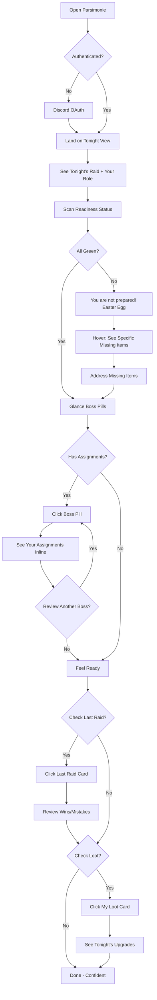
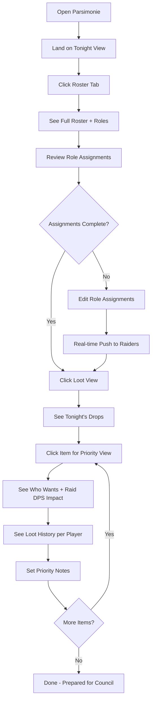
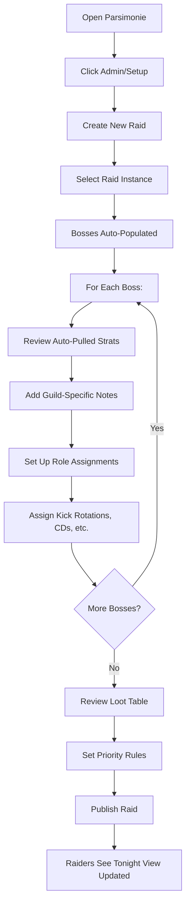
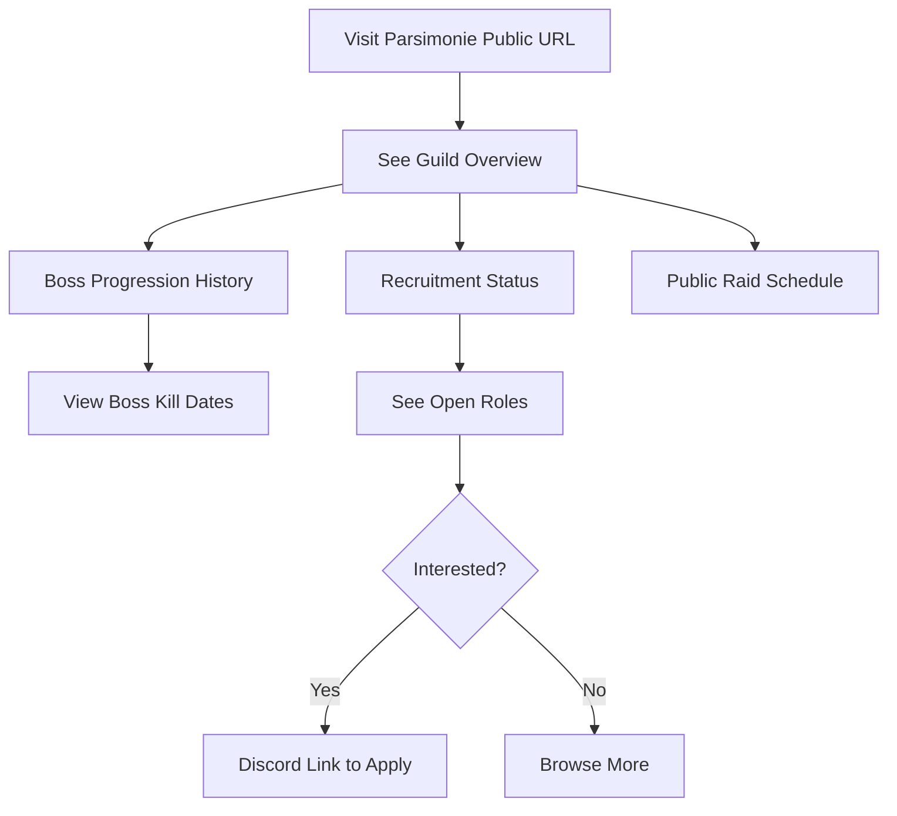

# UX Design Specification - Parsimonie

**Author:** Yaji
**Date:** 2026-02-04

---

## Executive Summary

### Project Vision

Parsimonie is a centralized WoW TBC Anniversary guild hub that eliminates the pain of juggling WarcraftLogs, Wowhead, and Battle.net tabs. The core philosophy is *"Optimization that reduces stress, not causes it"* — psychological safety as the key differentiator in the guild management space.

The platform aggregates raider stats, loot optimization, and roster management into one clean experience, enabling raiders to see "what to bring, what to need, what to roll on" without tab-switching anxiety.

### Target Users

| User Type | Description | Core Need |
|-----------|-------------|-----------|
| **Raider** | Guild member prepping for raids | See personal readiness, loot priorities, and raid prep in one clean view |
| **Officer** | Raid organizer managing roster/loot | Streamlined role assignments + raid DPS impact visibility for optimization |
| **Guild Master** | Strategic leader overseeing progression | High-level guild health and progression without multiple data sources |
| **Public Visitor** | Unauthenticated user | Browse public guild info (recruitment status, boss history) |

### Key Design Challenges

1. **Information Density vs. Clarity** — Aggregating WarcraftLogs + Battle.net + Wowhead data risks overwhelming users. Need clean visual hierarchy and progressive disclosure.

2. **Multi-User Visibility** — Officers see raid DPS impact, but so do raiders (transparency builds trust). Must avoid "surveillance" feel while keeping optimization data visible to all.

3. **Auth Gating Complexity** — Discord OAuth with guild server + role verification must feel seamless, not like a bouncer rejecting entry.

4. **Real-Time Expectations Management** — Only role assignments update live (SignalR). Other areas are refresh-to-see. Users may expect everything real-time; UX must set correct expectations.

### Design Opportunities

1. **Anti-Anxiety Patterns** — Visual design that frames optimization as supportive, not judgmental. Positive framing like "You're close!" vs. accusatory "You're missing X".

2. **Contextual Prep Flows** — Raid Prep Checklist as a calm companion guiding raiders through preparation, not a stressful todo list.

3. **Progressive Disclosure** — Surface key info first (what to bring), details on demand (full stat breakdowns). Reduces cognitive load.

4. **Role-Based Views** — Same data, different emphasis. Raiders see personal readiness. Officers see roster gaps. GM sees guild health. Context-appropriate presentation.

## Core User Experience

### Defining Experience

The core experience follows a **temporal flow tied to the raid cycle**:

| Phase | Core Question | Frequency |
|-------|---------------|-----------|
| **Pre-Raid** | "Am I ready? What's my role? How did we do last time?" | High (every raid) |
| **During Raid** | "This dropped — should I roll?" | Medium (loot moments) |
| **Post-Raid** | "How did I/we do?" | Lower (review sessions) |

**Pre-Raid includes a "Last Raid Recap"** — a quick summary of the previous raid's stats, highlighting:
- Personal wins to replicate
- Mistakes to avoid
- Team achievements or wipes to remember

This turns reflection into preparation — "learn from last raid before tonight's pull."

**Primary Core Action:** A raider opens Parsimonie and within **5 seconds** knows:
1. Their role assignment for tonight
2. Their readiness status (consumables, gear)
3. What loot to prioritize from tonight's bosses
4. Quick recap of last raid (wins/mistakes to remember)

This is the "dashboard glance" — the moment that replaces 3 tabs with one.

### Platform Strategy

- **Web SPA** — Angular 21 with MPA-style tab navigation
- **Desktop-first** — Raiders at computers during prep/play; responsive for mobile check-ins
- **Evergreen browsers** — Chrome, Firefox, Edge, Safari (latest 2 versions)
- **Always online** — No offline mode needed
- **Keyboard-friendly** — Power users navigating quickly

### Effortless Interactions

All of these should feel **completely automatic**:

| Interaction | Effortless Behavior |
|-------------|---------------------|
| **Character Sync** | Battle.net OAuth pulls character data — zero manual entry |
| **Loot Suggestions** | Spec-aware recommendations appear automatically based on current gear |
| **Raid Prep Checklist** | Auto-generated per boss based on role and spec |
| **Role Assignments** | Real-time push (SignalR) — raider sees their role without refreshing |
| **Log Integration** | WarcraftLogs data pulled automatically — no copy/paste |

**Design Principle:** If the user has to manually enter data that an API could provide, we've failed.

### Critical Success Moments

| Moment | Success Feeling |
|--------|-----------------|
| **5-Second Glance** | Raider opens app, instantly sees "You're ready for tonight" or "You need X" |
| **Zero Wowhead** | Raider never has to open Wowhead to understand an item or check a boss — it's all here |
| **Post-Raid Clarity** | After raid, stats and performance show "here's how you contributed" without anxiety |

### Experience Principles

1. **Temporal Flow** — UI follows the raid cycle: Prep → Raid → Review. Navigation reflects where you are in that cycle.

2. **5-Second Clarity** — The most important info is visible within 5 seconds of landing. No hunting.

3. **Zero External Tabs** — If users open Wowhead or WarcraftLogs separately, we haven't done our job.

4. **Effortless by Default** — Sync, suggest, generate. Manual input is the exception, not the rule.

5. **Supportive, Not Judgmental** — Optimization framed as "here's how to be even better" not "you're doing it wrong."

## Desired Emotional Response

### Primary Emotional Goals

**North Star Emotion: Calm Confidence**

Users should feel: *"I know what I need to do, and I trust this tool to help me get there."*

| Emotional Goal | What It Means | How We Achieve It |
|----------------|---------------|-------------------|
| **Calm** | No anxiety, no overwhelm | Clean hierarchy, progressive disclosure, no information dump |
| **Confident** | "I'm ready" not "Am I ready?" | Clear status indicators, actionable next steps |
| **Supported** | Tool is an ally, not a judge | Positive framing, no shame language |
| **Trusting** | Loot is fair, data is accurate | Transparent logic, explainable decisions |

### Emotional Journey Mapping

| Moment | Emotional Transition |
|--------|---------------------|
| **First Visit** | Skeptical → Curious → "This is cleaner" |
| **Pre-Raid Prep** | Scattered → Calm → "I know my role and what to bring" |
| **Last Raid Recap** | Apprehensive → Reflective → "I can learn from this" |
| **Loot Decision** | Confused → Clear → "I understand why this is my priority" |
| **Post-Raid Review** | Defensive → Curious → "Here's how I contributed" |
| **Return Visit** | Neutral → Easy → "I know exactly where to look" |

### Micro-Emotions

**Loot System Emotions (Critical):**

The loot system is emotionally charged in any guild. Parsimonie must make loot feel:

| Feeling | Design Approach |
|---------|-----------------|
| **Fair** | Transparent priority logic visible to everyone |
| **Logical** | Decisions are explained, not arbitrary |
| **Rational** | Data-driven recommendations, not subjective opinions |
| **Non-Dramatic** | Information, not accusations — "This is an upgrade for you" not "You NEED this" |

**Emotions to Avoid:**

| Emotion | Trigger | Prevention |
|---------|---------|------------|
| **Shame** | "You underperformed" | Frame as "Here's an opportunity" |
| **Anxiety** | Too much data at once | Progressive disclosure, clear hierarchy |
| **Surveillance** | "Officers watching you" | Same view for everyone, transparency |
| **Overwhelm** | Information dump | 5-second glance, details on demand |
| **Loot Drama** | Unexplained decisions | Always show the "why" behind suggestions |

### Design Implications

| Emotional Goal | UX Design Approach |
|----------------|-------------------|
| **Calm** | Generous whitespace, muted colors, no urgent/alarming UI patterns |
| **Confident** | Clear "ready/not ready" states, checkmarks, progress indicators |
| **Supported** | Encouraging microcopy ("You're close!", "Almost there!") |
| **Fair (Loot)** | Visible explanation for every loot recommendation |
| **Equal** | Same UI, same data, same emotional tone for Raiders and Officers |

### Emotional Design Principles

1. **Calm Confidence Over Urgent Action** — No red alerts, no anxiety-inducing countdowns. Status is informative, not alarming.

2. **Explain Everything** — Every loot recommendation, every stat, every suggestion has a visible "why." No black boxes.

3. **Same Tool, Same Feeling** — Officers and Raiders experience the same emotional tone. No hierarchy of anxiety.

4. **Positive Framing Always** — "You need 2 more consumables" not "You're missing consumables." Progress, not deficiency.

5. **Trust Through Transparency** — If users can see the logic, they trust the output. Hidden algorithms breed suspicion.

## UX Pattern Analysis & Inspiration

### Inspiring Products Analysis

| Product | Strengths | Weakness | Key Learning |
|---------|-----------|----------|--------------|
| **AskMrRobot** | Powerful gear simulation, set comparison, side-by-side views | Too many options upfront (Best in Bags, Best in Slot, Upgrade Finder, Simple Sim...) — intimidating | **Simple default, power on demand** |
| **SixtyUpgrades** | Current gear at a glance, filtered replacement search, clean UI | Limited to gear planning | **Progressive filtering** — show what you have, narrow to what you need |
| **Wipefest** | Simplified log extraction, mechanics failures by player/raid, consumables/enchants status, click-to-reveal info | Can't deep dive or add custom conditions | **Summary → Detail pattern** — click to expand, instant display |
| **Wowhead** | Comprehensive data (gear, rep, boss strats) — everything you need exists | Navigation noise (guides, leveling sections irrelevant to raiders), takes time to browse | **Curated depth** — comprehensive data, focused navigation |
| **Raider.IO** | Clean card-based layouts, instant character lookup | Focused only on M+ scores | **Card-based scannable info** |
| **WarcraftLogs** | Deep analysis, authoritative data | Requires multiple tabs, learning curve | **Contextual drill-down** — expand without navigating away |

### Transferable UX Patterns

**1. Simple Default, Power on Demand (from AskMrRobot lesson)**
- Start with the most common action (e.g., "Am I ready for raid?")
- Hide advanced options behind a clear "Customize" or "Advanced" toggle
- Don't overwhelm with choices upfront

**2. Summary → Detail Click-to-Reveal (from Wipefest)**
- Show summary cards/rows first
- Click expands inline with full details — instant, no page load
- Quick and efficient information retrieval

**3. Focused Navigation (from Wowhead anti-pattern)**
- Only show navigation relevant to the user's context
- Raiders don't need leveling guides — don't show them
- Reduce cognitive load by hiding irrelevant sections

**4. Progressive Filtering (from SixtyUpgrades)**
- Show current state first ("Here's your gear")
- Allow filtering to narrow down ("Show upgrades from Karazhan only")
- Build from what user has to what user needs

**5. Curated Depth (Wowhead + Wipefest hybrid)**
- Have the comprehensive data (like Wowhead)
- But surface only what's relevant (like Wipefest's focused extraction)
- Deep data, shallow navigation

### Anti-Patterns to Avoid

| Anti-Pattern | Source | Why It's Bad | Our Alternative |
|--------------|--------|--------------|-----------------|
| **Option Overload** | AskMrRobot | Intimidating first experience | Simple default view, advanced options hidden |
| **Navigation Noise** | Wowhead | Irrelevant sections slow down finding what you need | Focused nav — only raiding-relevant sections |
| **Shallow Customization** | Wipefest | Can't deep dive when you need to | Offer drill-down paths for power users |
| **Tab-Switching Hell** | WarcraftLogs | Context-switching breaks flow | All-in-one with expand-in-place details |

### Design Inspiration Strategy

**What to Adopt:**
- Wipefest's click-to-reveal pattern — instant info display
- SixtyUpgrades' "current gear → find replacement" flow
- Card-based layouts for scannable information

**What to Adapt:**
- AskMrRobot's comparison UI — but with simpler default view
- Wowhead's comprehensive data — but with focused, noise-free navigation
- Wipefest's consumables/enchants status — add to prep checklist

**What to Avoid:**
- Multiple options on landing (AskMrRobot's "what do I click?")
- Irrelevant navigation sections (Wowhead's guides/leveling noise)
- Forcing tab switches for related data (WarcraftLogs fragmentation)

## Design System Foundation

### Design System Choice

**Tailwind CSS + Headless Components**

A utility-first CSS framework combined with custom Angular components built from scratch, giving maximum control over the visual design while maintaining fast development velocity.

### Rationale for Selection

| Factor | Why Tailwind + Headless |
|--------|------------------------|
| **Solo Developer** | Utility classes are fast to write — no context-switching to separate CSS files |
| **Calm Confidence Aesthetic** | Total control over spacing, colors, typography — no fighting default Material/corporate styles |
| **Gaming/WoW Feel** | Easy to create unique, non-corporate visual identity |
| **Angular 21 Compatible** | Tailwind works seamlessly with Angular's component architecture |
| **Focused Component Set** | Build exactly what's needed (dashboard cards, loot tables, prep checklists) — no bloat |

### Implementation Approach

1. **Tailwind CSS** — Utility-first styling for all components
2. **Custom Angular Components** — Build focused components for Parsimonie's specific needs
3. **Design Tokens** — Define color palette, spacing scale, typography in Tailwind config
4. **Component Library** — Create reusable components: cards, tables, progress indicators, expand/collapse panels

### Customization Strategy

| Element | Approach |
|---------|----------|
| **Colors** | Custom palette supporting calm confidence (muted tones, no harsh reds) |
| **Spacing** | Generous whitespace for readability and calm feel |
| **Typography** | Clean, readable fonts — gaming-adjacent but professional |
| **Components** | Purpose-built for raid prep, loot, stats — no generic enterprise components |
| **Dark Mode** | Primary focus — raiders often play in dark environments |

## Defining Core Experience

### Defining Experience Statement

> **"Open Parsimonie, see tonight's raid, your role, and your job on every boss — all in one place."**

This is the moment that replaces 3 tabs with one. The user doesn't hunt, doesn't click around, doesn't wait. They land, they see, they know.

### Information Hierarchy

| Priority | What | Example | Location |
|----------|------|---------|----------|
| **1st (Glance)** | Tonight's Raid + Your Role | "Karazhan — Main Tank" | Above the fold, immediate |
| **2nd (Glance)** | Readiness Status | "Ready" or "2 consumables needed" | Above the fold, immediate |
| **3rd (Quick drill-down)** | Boss-by-Boss Attributions | Moroes: "Kick Garotte at 3rd cast" | Expandable boss pills |
| **4th (One tab away)** | Last Raid Recap | Previous performance, wins/mistakes | Separate tab/panel |
| **5th (One tab away)** | Loot Priorities | Upgrade planning | Separate tab/panel |

### User Mental Model

**Prep vs. Planning Separation:**
- **Prep mode (immediate):** "Where am I going? What's my job?" → Tonight's raid, role, boss assignments
- **Planning mode (secondary):** "What do I want? How did I do?" → Loot priorities, raid recap

These are different mental modes. The magic moment is *prep* — knowing your assignment instantly. Loot and recap are important but are *planning*, accessed when the user shifts mindset.

### Boss Attribution UX Pattern

Uses the **Summary → Detail Click-to-Reveal** pattern:

```
Tonight: Karazhan (Full Clear)
Your Role: Main Tank

[Attumen] [Moroes] [Maiden] [Opera] [Curator] [Shade] [Chess] [Prince] [Nightbane]
            ↓ expanded
┌─────────────────────────────────────────┐
│ Moroes — Your Assignments:              │
│ • Kick Garotte on 3rd cast              │
│ • Pickup Baroness add                   │
│ • Shield Wall at 30% if healers behind  │
└─────────────────────────────────────────┘
```

- Boss list visible at a glance (clickable pills/tabs)
- Click any boss → instant inline expansion with YOUR specific assignments
- No page navigation, no modal — just expand in place

### Experience Mechanics

| Phase | What Happens |
|-------|-------------|
| **1. Landing** | Dashboard shows: Tonight's Raid + Your Role — no clicks required |
| **2. Instant Scan** | Below that: Readiness indicator (green/yellow) — "You're ready" or "2 items needed" |
| **3. Boss Drill-Down** | Clickable boss pills — expand any boss to see YOUR specific assignments |
| **4. Easy Access** | Clear tabs for "Last Raid" and "My Loot" — one click, no hunting |
| **5. Confidence** | User knows their assignment, knows their status — no lingering questions |

### Success Criteria

| Criterion | Target |
|-----------|--------|
| **Time to Assignment** | < 5 seconds to see tonight's raid + role |
| **Time to Boss Detail** | 1 click to see any boss's specific assignments |
| **Zero Confusion** | User never asks "where do I find...?" |
| **No Tab Switching** | All prep info in one place — Wowhead/WarcraftLogs not needed |

## Visual Design Foundation

### Color System

**Palette Inspiration:** The Burning Crusade logo — fel green glow, metallic gold, dark portal depths

| Role | Color | Hex | Usage |
|------|-------|-----|-------|
| **Background (Deep)** | Dark Portal Black | `#0d0f0e` | Page background |
| **Background (Surface)** | Outland Gray | `#1a1d1c` | Cards, panels |
| **Background (Elevated)** | Netherstorm Gray | `#252a28` | Hover states, elevated surfaces |
| **Primary Accent** | Fel Green | `#70c04a` | Primary actions, key highlights |
| **Primary Glow** | Fel Green Light | `#9dd977` | Hover states, glows |
| **Secondary Accent** | TBC Gold | `#d4a843` | Secondary highlights, important info |
| **Secondary Warm** | Bronze | `#c49a3d` | Warm accents |
| **Text Primary** | Off-White | `#e8e6e1` | Primary text |
| **Text Secondary** | Muted Gray | `#9a9a96` | Secondary text, labels |
| **Status: Ready** | Fel Green | `#70c04a` | Ready, success states |
| **Status: Action Needed** | Amber/Gold | `#d4a843` | Needs attention (not alarming) |
| **Status: Neutral** | Gray | `#6b6b6b` | Inactive, disabled |

**No Red:** Avoiding harsh red for "error" states — use amber/gold for "needs attention" to maintain calm confidence.

### Typography System

| Element | Font | Size | Weight | Usage |
|---------|------|------|--------|-------|
| **Headings** | Inter or Outfit | 24-32px | 600-700 | Page titles, section headers |
| **Subheadings** | Inter or Outfit | 18-20px | 500-600 | Card titles, boss names |
| **Body** | Inter | 14-16px | 400 | Primary content, descriptions |
| **Data** | Inter or JetBrains Mono | 14px | 400 | Stats, numbers, tables |
| **Labels** | Inter | 12-13px | 500 | Form labels, metadata |
| **Microcopy** | Inter | 12px | 400 | Helper text, timestamps |

**Rationale:**
- **Inter** — Clean, highly readable, excellent for data-heavy interfaces
- **Outfit** (alt for headings) — Slightly more personality, still professional
- **JetBrains Mono** (optional for data) — Monospace for aligned numbers in tables

### Spacing & Layout Foundation

| Token | Value | Usage |
|-------|-------|-------|
| **Base Unit** | 4px | Foundation for all spacing |
| **xs** | 4px | Tight spacing (icon gaps) |
| **sm** | 8px | Compact spacing (within components) |
| **md** | 16px | Standard spacing (between elements) |
| **lg** | 24px | Section spacing |
| **xl** | 32px | Major section breaks |
| **2xl** | 48px | Page-level spacing |

**Layout Principles:**
- **Generous whitespace** — Cards have 16-24px internal padding
- **Clear hierarchy** — Spacing increases with hierarchy level
- **Breathing room** — Don't pack elements tightly; calm > dense

**Grid:**
- 12-column grid for flexibility
- Max content width: 1280px (focused, not sprawling)
- Sidebar (if needed): 240-280px

### Accessibility Considerations

| Requirement | Target | Approach |
|-------------|--------|----------|
| **Contrast Ratio** | WCAG AA (4.5:1 minimum) | Fel green on dark passes; gold on dark passes |
| **Focus States** | Visible focus rings | Fel green glow outline on focus |
| **Color Independence** | Don't rely on color alone | Icons + text labels alongside color indicators |
| **Text Size** | Minimum 14px body | Ensure readability |

## Design Direction Decision

### Design Directions Explored

| Direction | Layout Style | Strengths | Decision |
|-----------|-------------|-----------|----------|
| **1. Dashboard Focus** | Hero card + pills + quick-access | Great boss expansion UX, 5-second glance | Borrow boss expansion pattern |
| **2. Compact Cards** | Two-column with sidebar | Dense, power-user friendly | Not selected |
| **3. Full Width Sections** | Horizontal bands, scannable | Clean, magazine-style, easy to scan | **Selected as base** |

### Chosen Direction

**Direction 3: Full Width Sections** with **boss expansion from Direction 1**

A hybrid approach combining:
- **From Direction 3:** Horizontal section bands, inline status, clean top-to-bottom scan
- **From Direction 1:** Clickable boss pills that expand inline with YOUR specific assignments

### Design Rationale

| Decision | Rationale |
|----------|----------|
| **Full-width sections** | Clean, scannable, each section is self-contained — reduces cognitive load |
| **Inline status row** | Tonight's raid + role + readiness all visible in one horizontal scan |
| **Boss pill expansion** | Click-to-reveal matches Wipefest pattern you liked — instant, no modal, no page change |
| **Quick-access cards** | Last Raid and Loot one click away, but not cluttering the main view |

### Implementation Approach

```
┌────────────────────────────────────────────────────────────────────┐
│ [Section 1: Tonight's Raid]                                        │
│ 🏰 Karazhan — Full Clear    🛡️ Main Tank    ✓ Gear  ✓ Cons  ⚠ Ench │
├────────────────────────────────────────────────────────────────────┤
│ [Section 2: Boss Assignments]                                      │
│ [Attumen•] [Moroes•] [Maiden] [Opera•] [Curator•] [Shade] [Prince•]│
│                                                                    │
│ ┌─ Moroes ─────────────────────────────────────────────────────┐   │
│ │ → Kick Garotte on 3rd cast                                   │   │
│ │ → Pickup Baroness add                                        │   │
│ │ → Shield Wall at 30% if healers behind                       │   │
│ └──────────────────────────────────────────────────────────┘   │
├────────────────────────────────────────────────────────────────────┤
│ [Section 3: Quick Access]                                          │
│ [📊 Last Raid Recap]  [💎 My Loot Priorities]  [👥 Full Roster]    │
└────────────────────────────────────────────────────────────────────┘
```

### Key Interaction Patterns

| Pattern | Behavior |
|---------|----------|
| **Landing** | Full-width sections load, no clicks needed to see raid + role + status |
| **Boss Drill-Down** | Click any boss pill → expands inline below the pills |
| **Quick Access** | Cards at bottom link to Last Raid, Loot, Roster — one click |
| **Collapse** | Click active boss pill again to collapse, or click another boss to switch |

## User Journey Flows

### Journey 1: Raider — "Raid Night Prep"

**User:** Raider (e.g., Kira, Affliction Warlock)
**Goal:** Check assignments, review mechanics, feel ready for tonight's raid



**Readiness Status UX:**

| State | Display | Interaction |
|-------|---------|-------------|
| **All Green** | ✓ Ready | No action needed |
| **Something Missing** | ⚠️ "You are not prepared!" | Hover to see details |

**Hover Tooltip (MVP):**
```
┌─────────────────────────────────────────┐
│ ⚠️ Enchants: 1 Missing                  │
│                                         │
│ • Chest: Missing +6 All Stats           │
│   → Enchant: Exceptional Stats          │
└─────────────────────────────────────────┘
```

**Hover Tooltip (Future Version):**
```
┌─────────────────────────────────────────┐
│ ⚠️ Enchants: 1 Missing                  │
│                                         │
│ • Chest: Missing +6 All Stats           │
│   → Enchant: Exceptional Stats          │
│   → Mats: 4x Large Prismatic Shard,     │
│           4x Greater Planar Essence     │
│   → Guild Enchanters: Threx, Mirya      │
└─────────────────────────────────────────┘
```

**Enchant Validation Rules:**
- Only check enchants relevant to character's **class + current spec**
- Rogue sees: AP, Agility, Hit enchants
- Rogue does NOT see: Healing power, Spell damage enchants
- Validation is role/class-aware, not generic

---

### Journey 2: Officer — "Loot Council Prep"

**User:** Officer (e.g., Marcus, Prot Paladin)
**Goal:** Prep loot priorities with data-backed decisions



**Key Moments:**
- **Same UI as Raider:** Officer sees same data, just has edit permissions
- **Transparent logic:** DPS impact visible, loot history visible
- **Real-time push:** Role assignments update for all raiders instantly (SignalR)

---

### Journey 3: Guild Master — "New Tier Setup"

**User:** GM (e.g., Yaji)
**Goal:** Set up strats, assignments, loot for new raid content



**Key Moments:**
- **Auto-pull from Wowhead:** Boss strats pre-populated
- **Drag-drop assignments:** Visual assignment interface
- **One publish:** Everything goes live for raiders

---

### Journey 4: Public Visitor — "Guild Discovery"

**User:** Unauthenticated visitor
**Goal:** Browse guild info, check recruitment



**Key Moments:**
- **No auth required:** Public page for recruitment
- **Clean progression display:** Boss kills, dates
- **Clear recruitment CTA:** Discord link for applications

---

### Journey Patterns

| Pattern | Description | Used In |
|---------|-------------|--------|
| **5-Second Glance** | Critical info visible immediately on landing | Raider, Officer |
| **Click-to-Reveal** | Boss pills expand inline, no page navigation | Raider, Officer |
| **Hover for Details** | Secondary info on hover (missing items, tooltips) | Raider readiness |
| **Real-Time Push** | Role assignments update live via SignalR | Officer → Raider |
| **Progressive Disclosure** | Summary first, details on demand | All journeys |

### Flow Optimization Principles

1. **Minimize Clicks to Value** — Raider sees raid + role in 0 clicks; boss details in 1 click
2. **Transparent Data** — Same info visible to Officers and Raiders (no hidden surveillance)
3. **Playful Easter Eggs** — "You are not prepared!" adds personality without shaming
4. **Role-Aware Validation** — Only show relevant enchants/consumables for class+spec
5. **Future-Proof Tooltips** — Design allows adding mats + guild crafters later

## Component Strategy

### Design System Components

**Foundation: Tailwind CSS + Custom Angular Components**

Tailwind provides the design tokens (colors, spacing, typography). All components are custom-built using these tokens for consistency.

| Token Category | Tailwind Config | Usage |
|----------------|-----------------|-------|
| **Colors** | Custom TBC palette | All components |
| **Spacing** | 4px base scale | Padding, margins, gaps |
| **Typography** | Inter, Outfit, JetBrains Mono | All text |
| **Borders** | Custom border colors | Cards, pills, sections |
| **Shadows** | Subtle dark-mode shadows | Elevation |

### Custom Components

#### 1. Section Band
**Purpose:** Full-width horizontal container for content sections
**States:** Default, with border, highlighted (gradient)
**Variants:** Standard, Hero (gradient background)
```
┌────────────────────────────────────────────────────────────────────┐
│ [Content goes here - full width, internal padding 24px]           │
└────────────────────────────────────────────────────────────────────┘
```

#### 2. Raid Header
**Purpose:** Display tonight's raid, role, and readiness in one row
**Content:** Raid icon, raid name, role badge, status indicators
**States:** Ready (all green), Action needed (has warnings)
```
🏰 Karazhan — Full Clear    🛡️ Main Tank    ✓ Gear  ✓ Cons  ⚠ Ench
```

#### 3. Status Indicator
**Purpose:** Show ready/action states for gear, consumables, enchants
**States:** Ready (green dot + "Ready"), Action (gold dot + count), Neutral (gray)
**Interaction:** Hover shows tooltip with details
```
✓ Ready          ⚠ 1 Missing (hover: "You are not prepared!")
```

#### 4. Boss Pill
**Purpose:** Clickable boss name for assignment drill-down
**States:** Default, Hover, Active (expanded), Has-Assignments (gold dot)
**Interaction:** Click expands inline panel below
```
[Attumen•] [Moroes•] [Maiden] [Opera•]
     ↑ gold dot = has assignments for you
```

#### 5. Boss Expansion Panel
**Purpose:** Show user's specific assignments for a boss
**Content:** Boss name, assignment count, list of assignments
**Animation:** Slide-down expand, instant collapse
```
┌─ Moroes ─────────────────────────────────────┐
│ → Kick Garotte on 3rd cast                  │
│ → Pickup Baroness add                       │
│ → Shield Wall at 30% if healers behind      │
└─────────────────────────────────────────────┘
```

#### 6. Quick Access Card
**Purpose:** Linked card for secondary views (Last Raid, Loot, Roster)
**Content:** Icon, title, description/preview
**States:** Default, Hover (border highlight)
**Interaction:** Click navigates to full view
```
┌──────────────────────────────┐
│ 📊 Last Raid Recap           │
│ 2 wipes, 2h 15m • View →     │
└──────────────────────────────┘
```

#### 7. Data Table
**Purpose:** Display stats, loot, roster information
**Content:** Headers, rows, sortable columns
**States:** Default, Hover row, Selected row
**Variants:** Compact (roster), Detailed (loot with tooltips)

#### 8. Tooltip
**Purpose:** Hover details for missing items, loot info, etc.
**Content:** Title, list items, optional action links
**Position:** Above/below trigger, auto-positioned
**Variants:** Simple (text only), Detailed (structured content)

#### 9. Progress Bar
**Purpose:** Visual progress for consumables, readiness
**States:** Complete (green), Partial (shows percentage), Empty
**Variants:** Thin (inline), Standard (with label)

#### 10. Nav Tabs
**Purpose:** MPA-style navigation between views
**Content:** Tab labels with optional icons
**States:** Default, Hover, Active
```
[Tonight] [Roster] [My Loot] [Last Raid]
    ↑ active = highlighted with fel green
```

#### 11. User Avatar
**Purpose:** Discord-linked user display in header
**Content:** Initials or Discord avatar image
**States:** Default, Hover (dropdown menu)

### Component Implementation Strategy

**Build Order (Priority):**

| Phase | Components | Rationale |
|-------|------------|----------|
| **Phase 1: Tonight View** | Section Band, Raid Header, Status Indicator, Boss Pill, Boss Expansion Panel | Core experience — Raider journey |
| **Phase 2: Navigation** | Nav Tabs, User Avatar, Quick Access Card | App shell + secondary navigation |
| **Phase 3: Data Views** | Data Table, Tooltip, Progress Bar | Loot, Roster, Stats views |

**Implementation Approach:**

1. **Angular Standalone Components** — Each component is self-contained
2. **Tailwind Utility Classes** — All styling via utilities, no custom CSS files
3. **Design Tokens in tailwind.config.js** — TBC palette, spacing scale
4. **TypeScript Interfaces** — Strong typing for component inputs
5. **OnPush Change Detection** — Performance optimization

### Implementation Roadmap

**Week 1-2: Core Shell**
- Section Band
- Nav Tabs
- User Avatar
- Basic routing

**Week 3-4: Tonight View**
- Raid Header
- Status Indicator (with "You are not prepared!" easter egg)
- Boss Pill
- Boss Expansion Panel
- Tooltip (for readiness hover)

**Week 5-6: Secondary Views**
- Quick Access Card
- Data Table
- Progress Bar
- Last Raid view
- My Loot view

## UX Consistency Patterns

### Feedback Patterns

| Feedback Type | Visual | Tone | Example |
|---------------|--------|------|--------|
| **Ready/Success** | Fel green dot + checkmark | Calm, affirming | "✓ Ready" |
| **Action Needed** | Gold dot + count | Playful, helpful | "⚠️ You are not prepared!" |
| **Info** | No dot, muted text | Neutral | "Last synced 5 min ago" |
| **Loading** | Subtle pulse/skeleton | Patient | Skeleton cards while loading |
| **System Error** | Red banner + retry | Urgent but recoverable | "Couldn't reach WarcraftLogs. Retry?" |

**No Red/Error States for User Data:**
- Missing enchants = Action (gold), not Error (red)
- Red only for system errors (API down, auth failed)
- User should never feel "punished" by the UI

### Navigation Patterns

| Pattern | Behavior | Used For |
|---------|----------|----------|
| **Tab Navigation** | Click tab → full view swap, URL updates | Tonight, Roster, Loot, Last Raid |
| **Click-to-Reveal** | Click → inline expansion below trigger | Boss pills, loot item details |
| **Hover-to-Inspect** | Hover → tooltip appears | Missing items, loot stats, abbreviations |
| **Quick Access Cards** | Click → navigate to full view | Secondary views from dashboard |
| **Back Navigation** | Browser back works naturally | All tab/view changes |

### Button Hierarchy

| Level | Style | Use For |
|-------|-------|--------|
| **Primary** | Fel green bg, dark text | Main action per view (Publish, Save) |
| **Secondary** | Transparent, green border | Alternative actions (Cancel, Edit) |
| **Ghost** | Text only, hover underline | Tertiary, inline actions (View details) |
| **Destructive** | Gold bg (not red) | Remove, cancel (rare, non-punishing) |

**Button Rules:**
- One primary button per view maximum
- Destructive actions require confirmation
- Ghost buttons for inline/contextual actions

### Loading & Empty States

| State | Display | Tone |
|-------|---------|------|
| **Loading** | Skeleton placeholders matching layout | Patient, no spinners |
| **Empty (No Data)** | Helpful message + action | "No raid scheduled. Officers can set one up." |
| **Empty (No Results)** | Filter suggestion | "No upgrades from this boss. Try another." |
| **Error (System)** | Red banner at top + retry button | "Couldn't reach WarcraftLogs. Retry?" |
| **Error (Auth)** | Redirect to login with message | "Session expired. Please log in again." |

### Tooltip Patterns

| Trigger | Delay | Position | Dismissal |
|---------|-------|----------|----------|
| **Hover** | 300ms delay | Auto (prefer above) | Mouse leave |
| **Focus** | Immediate | Auto (prefer above) | Blur |
| **Touch** | Long press | Above element | Tap elsewhere |

**Tooltip Content Rules:**
- Keep short (1-3 lines ideal)
- Structured lists for multiple items
- No interactive elements inside tooltips
- Future: Can include links for "Guild crafters" feature

### Form Patterns (Minimal)

| Element | Behavior |
|---------|----------|
| **Text Input** | Fel green border on focus, gold on validation warning |
| **Dropdown** | Custom styled to match palette |
| **Checkbox/Toggle** | Fel green when active |
| **Validation** | Inline below field, gold text (not red) |

**Form Rules:**
- Minimal forms in Parsimonie (mostly read-only dashboard)
- Officer/GM assignment interfaces use drag-drop, not forms
- Validation is helpful, not punishing

## Responsive Design & Accessibility

### Responsive Strategy

**Primary Target: Desktop (1024px+)**

Parsimonie is a desktop-first application. Raiders use it at their computers during raid prep and play. Mobile is deprioritized.

| Device | Priority | Approach |
|--------|----------|----------|
| **Desktop (1024px+)** | Primary | Full experience, all features |
| **Tablet (768px-1023px)** | Secondary | Responsive layout, same features |
| **Mobile (<768px)** | Low | Basic responsive, not optimized |

### Desktop Layout (Primary)

| Aspect | Specification |
|--------|---------------|
| **Content Width** | Max 1280px, centered |
| **Sections** | Full-width bands with 24px internal padding |
| **Boss Pills** | All visible in single row |
| **Quick Access** | 3-column grid |
| **Navigation** | Horizontal tabs in header |
| **Spacing** | Generous whitespace for calm feel |

### Breakpoint Strategy

| Breakpoint | Width | Behavior |
|------------|-------|----------|
| **Desktop** | ≥ 1024px | Full layout, 3-column grids |
| **Tablet** | 768px - 1023px | 2-column grids, slightly reduced padding |
| **Mobile** | < 768px | Single column, stacked sections (basic support) |

**Mobile is NOT a priority:**
- No dedicated mobile navigation design
- Basic responsive collapse only
- If it works, great; if not, use desktop

### Accessibility Strategy

**Target: WCAG AA Compliance**

| Requirement | Target | Implementation |
|-------------|--------|----------------|
| **Color Contrast** | 4.5:1 minimum | TBC palette verified — fel green/gold on dark backgrounds pass |
| **Keyboard Navigation** | Full support | Tab through all interactive elements in logical order |
| **Focus Indicators** | Visible | Fel green glow ring on focused elements |
| **Screen Readers** | ARIA labels | Semantic HTML + ARIA for Boss Pills, Status Indicators |
| **Touch Targets** | 44x44px minimum | All clickable elements meet minimum size |
| **Color Independence** | Icons + text | Status uses dot + text label, never color alone |

### Accessibility Implementation

**Semantic HTML:**
- Use `<nav>`, `<main>`, `<section>`, `<article>` appropriately
- Headings in logical hierarchy (h1 → h2 → h3)
- Lists for boss pills, assignment items

**ARIA Labels:**
- Boss pills: `aria-expanded`, `aria-controls` for expansion
- Status indicators: `aria-label` describing state
- Tooltips: `role="tooltip"`, `aria-describedby`

**Keyboard Support:**
- Tab: Navigate between interactive elements
- Enter/Space: Activate buttons, expand pills
- Escape: Close expanded panels, dismiss tooltips
- Arrow keys: Navigate within pill groups (optional enhancement)

**Focus Management:**
- Visible focus ring (fel green glow)
- Focus trap in modals (if any)
- Return focus after closing expanded panels

### Testing Strategy

**Browser Testing:**
- Chrome (primary)
- Firefox
- Edge
- Safari

**Accessibility Testing:**
- Lighthouse accessibility audit
- axe DevTools browser extension
- Keyboard-only navigation test
- Screen reader spot-check (NVDA or VoiceOver)

**No Mobile Testing Priority:**
- Desktop browsers only for initial release
- Mobile can be addressed post-MVP if needed